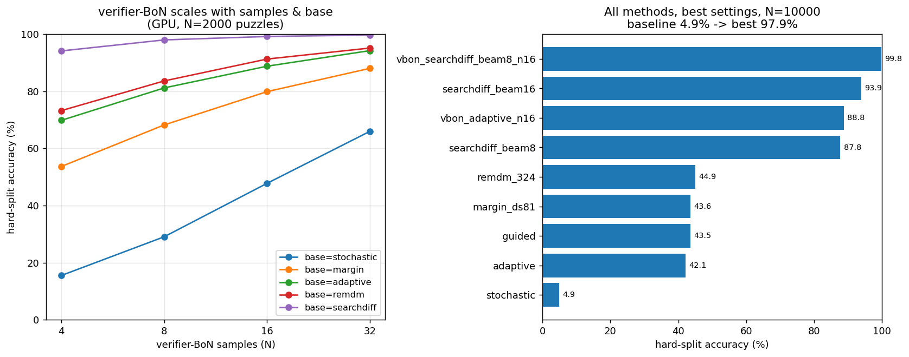

# Sudoku + дискретная диффузия: улучшение генерализации на hard-сплите

**Результат:** точность на hard-сплите поднята с 3.65% до 99.8% — полностью на инференсе, на том же
чекпоинте 6M, без переобучения.

| | hard-сплит |
|---|---:|
| бейзлайн репо (stochastic) | 3.65% |
| лучший метод из репо (margin) | 26.62% |
| лучший жадный  (remdm) | 44.9% |
| searchdiff (beam=16) | **93.9%** |
| verifier-bon searchdiff (beam=8, n=16) | **99.8%** |

Ключ к этому — разбор того как именно модель ошибается: провал паззла почти всегда вызван ровно одной
ошибкой из 81 коммита, и в этот момент истинная цифра стоит у модели второй. Жадный декодер обязан
выбрать сейчас и выбирает неверно; beam-поиск тащит обе версии дальше и даёт противоречию проявиться —
отсюда скачок с 44% до 94% в одном проходе.

Тестовое задание BayesGroup. Бейзлайн — маленькая masked diffusion model , решающая судоку. Нужно было
поресёрчить статьи, воспроизвести идеи, найти проблемы и показать рост метрик

## Постановка задачи

- Модель: `model_config_tiny` MDM, ~6M параметров, обучена на 100k «лёгких» судоку
- Основная метрика: доля точно решённых судоку на hard-сплите  (генерализация)
- Числа репо для сравнения: hard, стохастическое декодирование — 3.65%; hard, margin — 26.62%.

Все улучшения протестированы на публичном hard-сплите (`sapientinc/sudoku-extreme`)

## Запуск

```bash
python3 -m venv .venv && source .venv/bin/activate
pip install -r requirements-infer.txt
```

Единый скрипт `infer.py`, метод выбирается флагом `--strategy`. Веса берутся из `weights/` по умолчанию,
данные — любой CSV с колонками `quizzes,solutions` (0 = пусто).

```bash
python infer.py --strategy stochastic   --csv data_sample/sudoku_hard.csv          # бейзлайн
python infer.py --strategy margin        --csv data_sample/sudoku_hard.csv          # улучшение из репо
python infer.py --strategy adaptive      --csv data_sample/sudoku_hard.csv --reveal_per_step 1
python infer.py --strategy remdm          --csv data_sample/sudoku_hard.csv --remdm_steps 324
python infer.py --strategy searchdiff     --csv data_sample/sudoku_hard.csv --beam_size 8
python infer.py --strategy guided         --csv data_sample/sudoku_hard.csv          # веса weights/value_net

# verifier-bon: N раз прогнать базовый декодер и оставить валидное решение
python infer.py --strategy verifier-bon --base_strategy searchdiff --n_samples 16 --vbon_beam_size 8 \
                --csv data_sample/sudoku_hard.csv                                    # лучшая найденная настройка

# тот же отбор, но без знания правил судоку — по уверенности модели в своей сетке
python infer.py --strategy verifier-bon --base_strategy adaptive --n_samples 16 --vbon_select entropy \
                --csv data_sample/sudoku_hard.csv
```

`python infer.py --help` — все флаги.

## Что реализовано

| Метод | Откуда | Идея | Итог (hard) |
|---|---|---|---|
| `stochastic` | бейзлайн репо | top-k по top-1 вероятности | 4.9% |
| `margin` | [2502.06768](https://arxiv.org/abs/2502.06768) | ранжировать клетки по зазору top1−top2 | 29% при T=20 (как в оригинальном репо) → 43.6% при T=81 |
| `adaptive` | развитие 2502.06768 | раскрывать ~1 клетку за шаг, пересчитывать уверенность | 42.1% |
| `remdm` | [2503.00307](https://arxiv.org/abs/2503.00307) | ремаскинг + масштабирование числа шагов | 44.9% (лучший среди жадных) |
| `searchdiff` | [2602.02727](https://arxiv.org/abs/2602.02727) | beam-поиск с оценкой по ограничениям | 93.9% |
| `guided` | [2512.14765](https://arxiv.org/abs/2512.14765) | value-сеть + градиентное направление | 43.5% (*отрицательный*) |
| `verifier-bon` | моё | N сэмплов + проверка валидности | 99.8% (лучшее) |

Все числа — из финального прогона на N=10000

### Кратко по каждому методу

Обозначения: `A` — 81 клетка ответа, `n = |A|`; `x_t` — текущая (частично заполненная) сетка;
`p_i(v)` — вероятность цифры `v` в клетке `i` по модели; `p_i⁽¹⁾, p_i⁽²⁾` — первая и вторая по величине
вероятности в клетке; `M` — матрица 27×81 принадлежности клеток юнитам (9 строк + 9 столбцов + 9 квадратов);
`T` — число diffusion-шагов.

**`stochastic`** (бейзлайн репо) — раскрывает клетки по сырой top-1 вероятности. Это очень
  слабый сигнал: он говорит «модель уверена», но не говорит "безопасно" ли заполнять сейчас эту клетку.
  К уверенности модели добавляется случайный (гумбелевский) шум, вес которого линейно падает по мере
  декодирования; на каждом шаге маской остаются k клеток с наименьшим итоговым скором, и k тоже линейно
  убывает от числа масок до нуля.
**`margin`** ([2502.06768](https://arxiv.org/abs/2502.06768)) — ранжирует клетки по зазору между первой и
  второй цифрой и заполняет самые «уверенно отделенные» первыми. Порядок раскрытия оказался главным рычагом для MDM на судоку: 5% → 29% при тех же 20 шагах. Меняется только скор ранжирования:
  ```
  s_i = p_i⁽¹⁾ − p_i⁽²⁾
  ```
**`adaptive`** (развитие margin) — раскрывает примерно одну клетку за шаг, пересчитывая уверенность после
  каждого коммита. За шаг раскрывается одна клетка `argmax_{i ∈ masked} s_i`.

**`remdm`** ([2503.00307](https://arxiv.org/abs/2503.00307)) — на каждом из `S` шагов делает полный
  проход по доске и заново ранжирует по margin вообще все клетки, включая уже заполненные
  (margin/adaptive ранжируют только оставшиеся маски). Бюджет «сколько клеток держать замаскированными»
  линейно сжимается до нуля; маской остаются `k_s` худших по этому рангу — значит худшей может оказаться
  и уже закоммиченная клетка, и тогда она отменяется и переспрашивается заново:
  ```
  k_s = round( n · (1 − (s+1)/S) )      # клеток держим маской на шаге s
  маской остаются k_s клеток с наименьшим margin — среди ВСЕХ клеток, не только незаполненных
  ```
  Идея статьи в том, что так ранняя ошибка обратима. На практике это не срабатывает: инструментировал
  прогон — клетки переоткрываются **260 раз за паззл**, но цифра меняется **0 раз** (1 смена на 32 паззла).
  Причина: клетку отменяет и переспрашивает **тот же** сигнал (margin), который её изначально закоммитил
  неверно, — переспрошенная про тот же контекст модель даёт тот же ответ

**`searchdiff`** ([2602.02727](https://arxiv.org/abs/2602.02727)) — **лучший метод после verifier-bon**.
  Держит `beam` частичных сеток; каждая расширяет свою самую уверенную клетку в `cand` цифр, дети
  оцениваются как log-prob минус штраф за нарушения, лучшие `beam` выживают. 87.8% при beam=8 и **93.9%** при beam=16, одним проходом.
  Оценка гипотезы `b` — правдоподобие минус штраф за нарушения (`c_ud` — сколько раз цифра `d` встречается
  в юните `u`, то есть `V(b)` считает пары-дубликаты):
  ```
  S(b) = Σ_{i ∈ commit(b)} log p_i(x_i) − λ·V(b)
  V(b) = Σ_{u=1..27} Σ_{d=1..9} C(c_ud, 2)
  ```
**`guided`** ([2512.14765](https://arxiv.org/abs/2512.14765)) — *отрицательный результат*. Value-сеть
  предсказывает число нарушений, и на инференсе мы градиентно двигаем логиты в сторону их уменьшения.
  43.5% на лучшей настройке (lr=0.5), при более сильной guidance падает до 30%. Причина понятна и важна:
  у неверного раннего коммита **ноль локальных нарушений** — он глобально неверен, но локально безупречен.
  Поэтому градиент value-сети ≈0 ровно тогда, когда он был бы нужен, и в основном добавляет шум.
  Механика: логиты доски `ℓ` (размер 81×9) сдвигаются несколькими градиентными шагами, где `σ` — softmax
  по цифрам, а `p₀` — исходное распределение модели:
  ```
  ℓ  ←  ℓ − η · ∇_ℓ [ V(σ(ℓ)) + β · KL(p₀ ‖ σ(ℓ)) ]
  V(p) = MLP( relu(M·p − 1) )
  ```
  Именно из-за `relu(M·p − 1)` value-сеть видит только **текущие** нарушения: на локально чистой сетке её
  вход нулевой, а значит и градиент.
**`verifier-bon`** (моё) — прогоняет базовый декодер N раз и
  оставляет первую сетку, которая валидна и совместима с подсказками. Решение у паззла единственное
  (проверено на всём сплите), поэтому валидная сетка обязана быть верной.

## Результаты

**Воспроизведение бейзлайна.** На оригинальном easy-тесте чекпоинт даёт 99.5–100% (репо: 99.8%); на hard
при N=2000 — stochastic 5.2%, margin 29.5% (репо: 3.65% / 26.62%). Всё сходится.

**Финальный прогон** — все методы на лучших настройках из grid, полный hard-сплит из 10 000 примеров:

| Метод (настройка) | Точность (hard, N=10000) |
|---|---:|
| verifier-bon (searchdiff, beam=8, n=16) | 99.8% |
| searchdiff (beam=16) | 93.9% |
| verifier-bon (adaptive, n=16) | 88.8% |
| searchdiff (beam=8) | 87.8% |
| remdm (steps=324) | 44.9% |
| margin (diffusion_steps=81) | 43.6% |
| guided (lr=0.5) | 43.5% |
| adaptive (reveal=1) | 42.1% |
| stochastic (бейзлайн) | 4.9% |

Верхние две строки — разные вещи по стоимости: `searchdiff beam=16` это **один проход** (16 гипотез × 81 шаг),
а verifier-bon с beam=8, n=16 — 128 прогонов базы. При равном компьюте beam-поиск обгоняет сэмплирование:
93.9% (beam=16) против 88.8% (verifier-bon adaptive, n=16) — столько же forward-проходов.

### Перебор параметров

| Метод | Параметр | Значения → точность |
|---|---|---|
| margin | diffusion_steps | 20 / 64 / 81 = 29.5 / 41.6 / 44.3% |
| adaptive | reveal_per_step | 1 / 2 / 4 = 41.8 / 35.9 / 28.8% |
| remdm | remdm_steps | 81 / 162 / 324 = 43.9 / 44.5 / 45.5% |
| searchdiff | beam (cand=3) | 1 / 2 / 4 / 8 / 16 = 41.8 / 55.3 / 72.9 / 87.3 / 93.9% |
| searchdiff | cand (beam=8) | 2 / 3 / 5 = 80.2 / 87.3 / 88.2% (cand почти бесплатен) |
| guided | guidance_lr | 0.5 / 1 / 2 = 43.2 / 40.8 / 30.4% (сильнее — хуже) |

Все **жадные** методы (margin, adaptive, remdm, guided) упираются в один и тот же потолок ~42–45%, и
единственный «бесплатный» рычаг внутри них — больше diffusion-шагов. Из этого потолка выходит только
`searchdiff`: он не коммитит жадно, а держит альтернативы, и ширина beam гонит точность до 93.7% при том же
одном проходе

## Почему жадные декодеры упираются в ~44% и как из этого выйти

Из adaptive результатов можно увидеть что в 100% из 1164 проваленных паззлах ровно **одна** корневая ошибка: заполнение первой неправильной цифры. Вероятность корневой ошибки на один шаг p = 1.0% (1164 ошибки на 116 229). Шагов 81, ошибиться нельзя ни разу, поэтому `(1 − p)^81 = 44.3%` — ровно тот потолок,
который мы и наблюдаем (41.8%). То есть модель не «плохо решает судоку»: она ошибается на 1% шагов, просто
шагов много, а цена одной ошибки — весь ответ.

Что модель «думает» в момент ошибки — ранг истинной цифры в её распределении:

| | r1 | r2 | r3 | r>3 |
|---|---:|---:|---:|---:|
| в среднем | 82.6% | 6.9% | 3.0% | 7.5% |
| без промахов  | 100% | 0% | 0% | 0% |
| первый промах | 0% | **71.8%** | 22.1% | 6.1% |
| после первой ошибки | 0% | 38.5% | 16.7% | 44.8% |


Самое интересное — в первом промахе модель почти всегда ставит истину **второй**. Ответ ей, по сути,
известен — он просто проигрывает argmax'у. В ошибках после первого промаха истина в 45% случаев вообще
за пределами топ-3 — там контекст уже испорчен, и модель реально теряется.

Насколько велик запас — замерил оракулами, каждый из которых задаёт потолок целого класса методов:

| оракул | точность |
|---|---:|
| починить только первую ошибку | 96.6% |
| идеальный выбор внутри top-2 / top-3 | 83.0% / 96.3% |
| идеальный порядок раскрытия (откладывать неверные клетки) | 100% |

Раз истина во время первой ошибки почти всегда вторая, то достаточно не выбрасывать вторую версию. Поэтому
`searchdiff` с beam=16 даёт 93.9% против 44% у жадных, и практически упирается в оракул «идеальный выбор
внутри top-3» (96.3%)

## verifier-bon

### Масштабирование по базе и числу сэмплов (точность %, N=2000)

Точность verifier-bon — это вероятность, что хотя бы один из `N` сэмплов в точности верен:

```
acc(N) = P( существует j ≤ N :  x⁽ʲ⁾ = x* )

если бы сэмплы были независимы и каждый верен с вероятностью q:
acc(N) = 1 − (1 − q)^N
```

Отсюда точность растёт и по силе базы (через `q`), и по `N`.

| база \ n_samples | 4 | 8 | 16 | 32 |
|---|---:|---:|---:|---:|
| stochastic | 15.5 | 29.1 | 47.8 | 66.0 |
| margin | 53.7 | 68.2 | 79.9 | 88.0 |
| adaptive | 69.8 | 81.2 | 88.8 | 94.2 |
| remdm | 73.2 | 83.6 | 91.3 | 95.1 |
| **searchdiff** (beam=4) | **94.1** | **98.0** | **99.2** | **99.7** |

У stochastic/margin/adaptive/remdm параметра `beam` нет — их числа не менялись; строка `searchdiff`
пересчитана после починки бага в реализации beam (см. раздел выше).



Сэмплы не независимы, у базы `adaptive` одиночный проход даёт
`q = 42.1%`; будь сэмплы независимы, четырёх хватило бы для `1 − (1 − 0.421)⁴ = 88.8%`, а наблюдаем 69.8%.

| N | наблюдаем | идеал iid при q=42.1% |
|---:|---:|---:|---:|
| 4 | 69.8% | 88.8% |
| 8 | 81.2% | 98.7% |
| 16 | 88.8% | ~100% |
| 32 | 94.2% | ~100% |

То есть сэмплы часто повторяют одну и ту же ошибку. 

### Как выгоднее тратить бюджет сэмплов (N=2000)

| Идея | Результат | Вывод |
|---|---|---|
| Ширина beam у searchdiff | при n=8: beam 2/4/8 = 92.7 / 98.0 / 99.5% | beam важнее числа сэмплов |
| Больше сэмплов | beam=8: n=8 → 99.45%, n=16 → 99.75% | после ~99% прирост почти исчерпан |
| Смешанная база (микс баз) | 89.2–96.8% (числа со старой searchdiff-базой) | смешивать смысла нет |
| guided как база | ~81% при n=8, ~89% при n=16 | не лучше adaptive-базы |

Вывод: главный рычаг — сила базы, а не число сэмплов. Сильная база (searchdiff с широким beam) выходит на
99%+ уже при n=8, тогда как слабой не хватает и n=32. Но beam и n стоят одинаково — оба линейно множат число прогонов модели

### Без знания правил судоку

Проверка валидности знает правила судоку, значит метод
задаче-специфичен и никуда не переносится. Проверил, можно ли заменить её сигналом самой модели (средний `-log p`, флаг `--vbon_select entropy`):

```
s(x) = −(1/|A|) · Σ_{i ∈ A} log p(x_i | x)
x̂    = argmin_{j ≤ N} s(x⁽ʲ⁾)
```

Здесь сетка `x` подаётся модели целиком и клетка i ей видна

| селектор | n=4 | n=16 |
|---|---:|---:|
| случайный сэмпл (без отбора) | 38.2% | 37.8% |
| отбор по энтропии | 70.1% | 89.0% |
| проверка валидности | 70.1% | 89.1% |

Отбор по энтропии практически совпал с символьной проверкой


## Что в репозитории

- `infer.py` — все методы декодирования, единая точка входа.
- `weights/` — чекпоинт 6M (`mdm_tiny`) + маленькая обученная `value_net`.
- `data_sample/` — паззлы для запуска из коробки; `data_orig/` — оригинальный easy-тест репо.
- `results_sweep/` — результаты всех прогонов (JSON), полная таблица `ALL_CONFIGS.md`, графики.
- `experiments/` — воспроизведение прогонов: `run_easy.sh` (бейзлайн на easy-тесте), `run_sweep.sh`
  (grid всех настроек, N=2000), `run_final.sh` (лучшие настройки на всём hard-сплите, N=10000).
- `scripts/` — генерация данных, обучение `value_net`, графики, `base_analysis.py` (разбор ошибок
  бейзлайна) и `entropy_selector.py` (отбор по энтропии в BoN).
